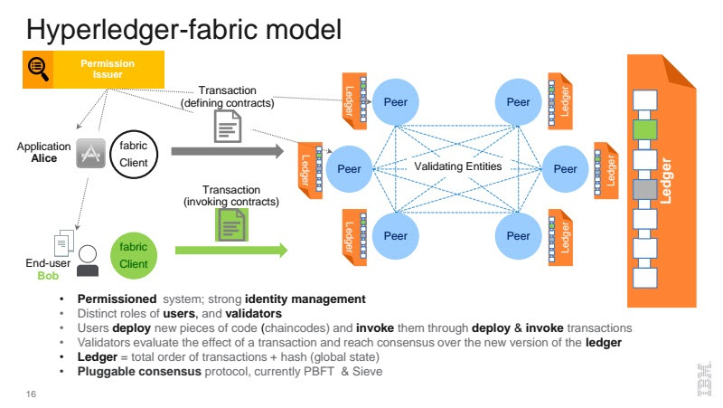
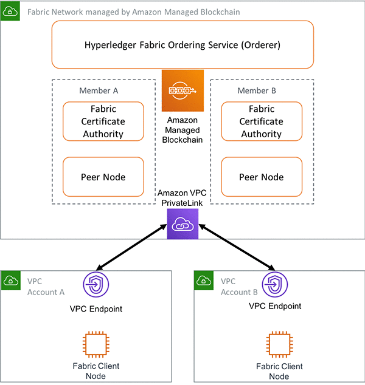

# AWS Hyperledger Blockchain: A Case of Kenyan Elections Management

We all know how tense the general elections get in any part of the world, no matter how advaced they claim their  democracy to be.

There are always cases and accusations of electoral malpractices, violent responses by opponents and their supporters, and outright vote rigging to win unfairly.

In the Kenyan scenario, many measures have been put in place over the last 3 decades to mitigate some of these challenges. However, more still needs to be done, especially in the transmission and tallying of the votes peacefully cast.

It's increasingly challenging to rig the elections at the voter authentication and voting stages, however, a lot requires to be done in the preceeding stages, transmission and tallying. These last two stages involve technology that can be made more verifiable and trustable to apeace everyone involved.

In this small project we will demonstrate the possibility of securing the votes electronically in a transparent secure manner and store data in a cryptographically encrypted ledger managed by ``AWS`` (Amazon Web Services), the world leader in cloud computing.

We will use ``AWS Kinesis Data Firehorse`` to capture data transmitted from the ``KIEMS`` kit (Kenya Integrated Elections Management System) at the polling stations. The data will be securely and openly stored in S3 (cheap data storage) accessible publicly. 

Kinesis Data Firehose provides the simplest approach for capturing, transforming, and loading data streams into AWS data stores. It also supports batching, encryption, and compression of streaming data. Firehose also helps in streaming to ``RedShift``, ``S3``, or ``ElasticSearch`` service, to copy data for processing by using additional services.

The data will be processed and it's metadata stored in ``DynamoDB`` (a NoSQL database) for analysis and a ``QLDB`` ledger generated in the AWS Managed Blockchain. Hyperledger Fabric will make this whole system decentralised and distributed to verified users (electoral candidates, observers, IEBC e.t.c).

Use permisioned private blockchain accessible by a select number of trusted users and major stakeholders.

### The data flow is

- Send data from devices to ``IoT Core`` via ``MQTT``
- IoT Core subscribes data and send it to - Kinesis Firehose
- Kinesis executes batch (transform data, Putting data together)
- Kinesis send batched data to S3 (Raw data)
- A second Lmbda function sends transformed images as PDF to a second S3
- A third Lambda function transforms metadata and stores in an immutable ledger in QLDB.
- Users can query the database through an API

Actually IoT core could be replaced with API Gateway and send data via HTTP. But because HTTP request is heavier than MQTT, I recommend you use MQTT.

``AWS Kinesis Data Firehose`` is used to execute batch. Let’s say the polling stations send data every minute. Kinesis Firehose accept the data then executes a batch which batches the data into 10 minutes pack and send it to S3 thus significantly saving cost.
## 1. Transmission of results

### Trust
All peers are identified and verified
Devices only send data from a specific GPS geolocations (if possible)
Only the devices of a ``specific IP range`` will be allowed to send their results and an immutable log kept for all to audit.
committing peers are carefully selected and verified

### Decentralization
Devices can be used as nodes to keep a copy of the ledger
Each peer has a copy of the updated ledger, no single user can make any change to the ledger except or the new entries by the processing pipeline.

### Security

Devices are authenticated before sending any results
Each device must have a role assigned to it during the configuration stages so it's the only producer that can send data to the ``Iot Core``.
Strict security with inbound rules allowing only a range of IP addresses of the devices.
Use of ``VPC endpoints`` to access other resources from the devices VPC.
VPC endpoint policies

VPC endpoint policies ensures the traffic between AWS services, such as Lambda, Amazon S3, and Amazon QLDB, does not leave the Amazon network.

AWS IoT message security: Device connections to AWS IoT use X.509 client certificates and AWS signature V4 for server authentication. Device communications are secured by TLS version 1.2 and AWS IoT requires devices to send the Server Name Indication (SNI) extension
when they connect.
Client authentication: AWS IoT supports three types of identity principals for device or client authentication:

 - X.509 client certificates

 - IAM users, groups, and roles

 - Amazon Cognito identities

AWS IoT device data and service endpoints: Each account has several device endpoints that are unique to the account and support specific IoT functions. The AWS IoT device data endpoints support a publish/subscribe protocol that is designed for the communication needs of IoT devices; however, other clients, such as apps and services, can also use this interface if their application requires the specialized features that these endpoints provide. The AWS IoT device service endpoints support device-centric access to security and management services.
You can also use your own ``fully-qualified domain name (FQDN)``, such as iebc.co.ke, and the associated server certificate to connect devices to AWS IoT by using Configurable endpoints.

The Kinesis Firehorse too must have a role assigned to it for it to send the collected data to th S3.
Use an ``IAM role`` and ``policies`` to manage temporary credentials for your producer and client applications to access Kinesis Data Firehose delivery streams.
Only specific biometrically authenticated persons can send results
Users linked to specific devices

For troubleshooting, the ``SSH port`` will only allow an individual IP address to log in via the ``bastion host``.

### Operations
The key steps involved for connecting your device to AWS IoT are:

- Create an ``EC2 instance`` and enable the correct port
- Add the app to the EC2 instance
- Obtain the certificate and private key for the app from AWS IoT
- Build the device-side application and transfer it along with the certificate and private key, and any other supporting files to the device
- Set up the sensor map with the device to track specific activities
- Launch a browser and navigate to your AWS IoT app
- Run the application on the device

One S3 receives and stores the images
An original backup is stored in this first bucket and made ``public read only``
All buckets have delete protection
All changes are logged and traced

## 2. Processing of results

### Trust
The results and analysis are recorded in a publicly available ledge accessible to all registered stakeholders, also known as members or peers. Any of them can compare the end results with the original documents in the first S3 bucket as uploaded by the Iot devices (KIEMS kits).
The logs in the log bucket are immutable and can be used for audit purposes, and any changes made are logged appropriately, no one can ever manipulate the logs forever, thanks to ``AWS QLDB`` (Quantum Ledger Blockchain).

### Decentralization
Peers and members make the ecosystem and make this system decentralised. All stakeholders ahve the same copy and no single member can make a change without the others noticing. The will then reject the fraudulent changes and kick out the untrustable member.
Each stakeholder to have their AWS accounts to host ``Hyperledger fabric nodes`` to make it both distributed and decentralised.

Hyperledger fabric up close looks like this for complete distribution and trust:

### Security
Specific roles are given to individuals to perform specific duties.
These are managed by ``AWS IAM``.
Iot devices access the AWS ecosystem through specified roles and authenticate via ``Amazon Cognito`` that strictly allows access only to verified devices and rejects all other trying to trick or hack into the system to place frauduent results.

Every action takes place within the AWS ecosystem so security of data is assured.
Implement Server-Side Encryption in Dependent Resources. Data is encrypted at rest and during transport.

Use ``CloudTrail`` to Monitor API Calls. Using the information collected by CloudTrail, you can determine the request that was made to Kinesis Data Firehose, the IP address from which the request was made, who made the request, when it was made, and additional details.

You use AWS published ``API`` calls to access Kinesis Data Firehose through the network. Clients must support ``Transport Layer Security (TLS) 1.2`` or later.
Clients must also support cipher suites with perfect forward secrecy (PFS) such as ``Ephemeral Diffie-Hellman (DHE)`` or ``Elliptic Curve Ephemeral Diffie-Hellman (ECDHE)``. 

AWS ``IoT Device Defender`` addresses these challenges by providing tools to identify security issues and deviations from best practices. You can use AWS IoT Device Defender to analyze, audit, and monitor connected devices to detect abnormal behavior, and mitigate security risks. AWS IoT Device Defender can audit device fleets to ensure they adhere to security best practices and detect abnormal behavior on devices. This makes it possible to enforce consistent security policies across your AWS IoT device fleet and respond quickly when devices are compromised.

As a managed service, Amazon QLDB is protected by the AWS global network security procedures.

All data stored in ``Amazon QLDB`` is fully encrypted at rest by default. When you access a ledger, QLDB decrypts the data transparently. 

Amazon QLDB only accepts secure connections that use the HTTPS protocol, which protects network traffic by using ``SSL/TLS``. Encryption in transit provides an additional layer of data protection by encrypting your data as it travels to and from QLDB. 

### Operations

Once transformed, the results are stored as pdf in a second S3.

Because ``S3`` is super cheap, we choose ``S3`` as a data lake. You can use ``DynamoDB``, ``Redshift``…. if you like.

To mitigate the challenge of reading hand written numbers, the sending station should print the data the way cheques are printed with payee details.
This makes it easy for human and the ``OCR`` (Optical character recognition) to get the correct details.

Analysis is done to give verifiable provisional results that anyone can access via a public link or API that updates the IEBC public site.
Logs and all modifications are added to the ``QLDB`` secured cryptographycally and rendered immutable. These logs can be made available on request in case of any doubts by the stakeholders.

Small lambda functions are required to convert the images to pdf, organize the files based on counties and constituencies.

# Voter identification/logging

This too can be secured by linking it to a ``QLDB`` to log the voting process.
It will ensure voters are marked and analysed once identified and voted. This will help give a clear picture of totall voters, categorised by poling center, constituency and county. Makes it difficult to ammend the total number of votes cast and alert when a person votes more than once.

In this diagram, IEBC and the major stakeholders each to have their AWS accounts they have full control of to host fabric client nodes. These fabric nodes keeps copies of the ledger and also acts as concensus and validators of the activitie in the AWS Managed Blockchain peer nodes. 

Here's how managed blockchain works:

## 3. Access to system
All access is logged in ``Cloudtrail`` and kept secure for audit purposes.

All activity logs are captured via Cloudwatch and logs sored in a secure S3 with alarms assigned for specific metrics.

AWS ``IoT Core`` policies determine what an authenticated identity can do. An authenticated identity is used by devices, mobile applications, web applications, and desktop applications. An authenticated identity can even be a user typing AWS IoT Core CLI commands.
### a. Admin Access
Have two admins with full access for redundancy purposes.
### b. Operators Access
Have limited access depending on their specific duties. 
The roles to be granted through a group access.

### c. Stakeholders Access
### d. Public access
Users can be allowed to see specific data through the shared links
The original images are available to the public.
Those who prefer the PDFs will also have access from the PDF S3 bucket arranged by county and constituency

# Option 2
Just upload the image to ``S3`` as attachment together with an electronic form with the same information.
The e-form is processed further for tallying.
The S3 contents have a delete protection.
An audit log is generated and securely kept in ``QLDB``.
Metadata from the bucket is processed and stored in ``DynamoDB`` (NoSql database) or further analysis

## Quantum Ledger Cost
Assuming 16m voters, each message is 1kb
 

| Resource | Usage | Cost|
|:--------| :------: | ----:|
| AWS IoT Core | 370 mesages per second published | - |
| Amazon API Gateway | 370 requests per second received | -|
| Amazon S3 | Put 370kb data per second |- |
| AWS Lambda | Invocations by above three services Average 74s duration with 128 MB RAM  | -  |
| Amazon QLDB | Write input/output from Lambda functions Add average 0.5 KB data per write query |  - |
| Amazon VPC S3 and API Gateway | VPC Endpoint across 2 availability zones | - 
 |
 | |Total Cost | - |
## Results Transmission Cost
Assuming 47,000 polling stations, each image is 4mb

| Resource | Usage | Cost|
|:--------| :------: | ----:|
|AWS IoT Core| 47,000 mesages  published| - |
|Amazon API Gateway| 47,000 requests received| - |
Amazon S3| Put 1mb data per second |-
Amazon S3| 47,000 * 4mb (188GB) data stored |-
AWS Lambda | Invocations by above three services Average ``74s`` duration with 128 MB RAM  | - 
Amazon Kinese Firehorse | | -
Amazon VPC S3 and API Gateway | VPC Endpoint across 2 availability zones | -
| |Total Cost | - |

## Hyperledger Managed Blockchain Cost

| Resource | Usage | Cost|
|:--------| :------: | ----:|
| QLDB | |-
| lambda | | -
|Lambda | | -|
API gateway | | -|
|Fabric Node | |-|
|Total Cost| | - |